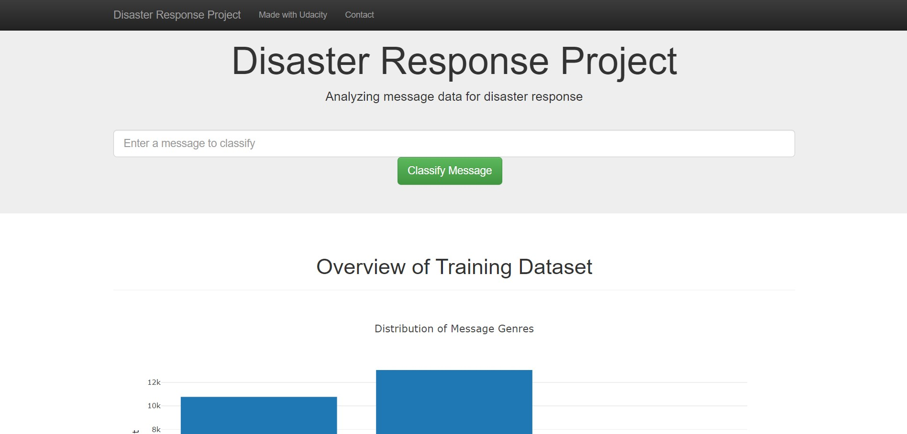
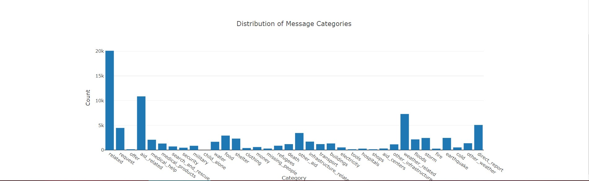
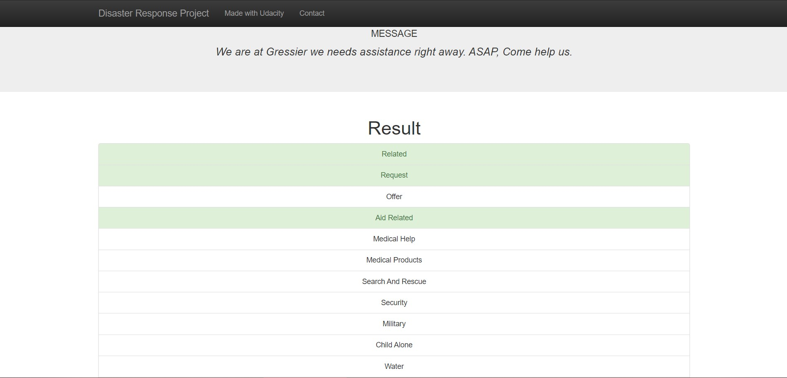
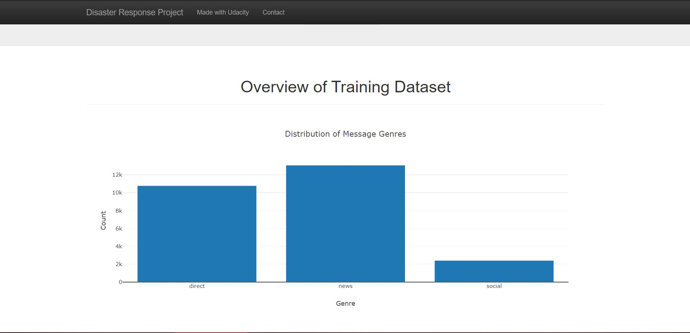

# Disaster Response Pipelines Project

## Table of Contents

1. [Project Motivation](#motivation)
2. [Installation](#installation)
	1. [Executing Program](#executing)
	2. [File Descriptions](#file)
3. [Author](#author)
4. [License and Acknowledgement](#license)
5. [Results](#results)

## Project Motivation

This Project is part of Data Scientist Nanodegree Program by Udacity in collaboration with Figure Eight.
The initial dataset contains pre-labelled tweets and messages from real-life disasters. 
The aim of this project is to build a Natural Language Processing tool that can categorize tweets and messages.

The Project is divided in the following Sections:

1. Data Processing and ETL Pipeline to extract data from source, clean data and save them in a proper databse structure.
2. Machine Learning Pipeline to train a model which is able to classify tweets and text messages in categories.
3. Web App to show model results in real time. 

### Installation

* Python 3.5+ (I used Python 3.7)
* SQLlite Database Libraqries: SQLalchemy
* Machine Learning Libraries: NumPy, SciPy, Pandas, Sciki-Learn
* Natural Language Process Libraries: NLTK
* Web App and Data Visualization: Flask, Plotly

### Executing Program:

1. Run the following commands in the project's root directory to set up your database and model.

    * To run ETL pipeline that cleans data and stores in database
        `python data/process_data.py data/disaster_messages.csv data/disaster_categories.csv data/DisasterResponse.db`
    * To run ML pipeline that trains classifier and saves
        `python models/train_classifier.py data/DisasterResponse.db models/classifier.pkl`

2. Run the following command in the app's directory to run your web app.
    `python run.py`

3. Go to http://0.0.0.0:3001/

### File Descriptions:

In the **data** and **models** folder you can find two jupyter notebook that will help you understand how the model works step by step:
1. **ETL Preparation Notebook**: learn everything about the implemented ETL pipeline
2. **ML Pipeline Preparation Notebook**: look at the Machine Learning Pipeline developed with NLTK and Scikit-Learn

You can use **ML Pipeline Preparation Notebook** to re-train the model or tune it through a dedicated Grid Search section.
In this case, it is warmly recommended to use a Linux machine to run Grid Search, especially if you are going to try a large combination of parameters.
Using a standard desktop/laptop (4 CPUs, RAM 8Gb or above) it may take several hours to complete. 

## Author

* [Kush Adhvaryu](https://github.com/kushadhvaryu)

## License and Acknowledgements

* [Udacity](https://www.udacity.com/) for providing such a complete Data Scientist Nanodegree Program
* [Figure Eight](https://www.figure-eight.com/) for providing tweets and messages dataset to train my model

## Results

1. These are the features in which the messages will be categorised into when you click **Classify Message**.

2. After clicking **Classify Message**, you can see the categories which the message belongs to gets highlighted in green.

3. The main page shows some graphs about training dataset, provided by Figure Eight.

